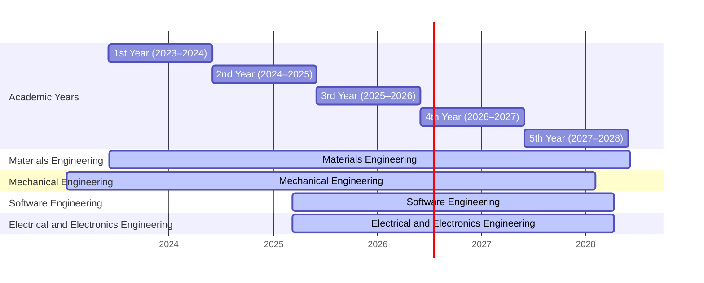
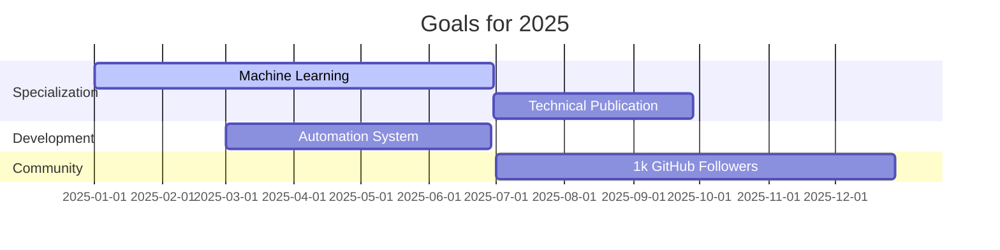
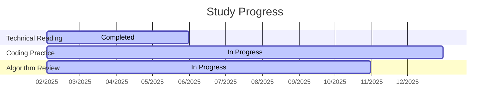

  <!-- Bandeira americana substituída -->
  

  <!-- Letreiro animado "United States" -->
  

  
  

    
    
  

  

    <h2 style="margin: 0;">🚀 Professional Portfolio</h2>
    

### 🎓 Academic Background

---

  <h3 style="margin-top: 0; display: flex; align-items: center; gap: 8px; justify-content: flex-start;">
    💼 Experience & Focus
  </h3>
  <ul style="list-style: none; padding-left: 0;">
    <li style="margin-bottom: 10px; text-align: left;">📊 Freelance Financial Administrator</li>
    <li style="margin-bottom: 10px; text-align: left;">🏭 Production Engineer</li>
    <li style="text-align: left;">💡 Focus: Process Automation, Data Analysis, Tech-Driven Solutions</li>
  </ul>

  <h3 style="margin-top: 0; display: flex; align-items: center; gap: 8px; justify-content: flex-start;">
    🌱 Current Learning
  </h3>
  <ul style="list-style: none; padding-left: 0;">
    <li style="margin-bottom: 10px; text-align: left;">🌐 Web Development</li>
    <li style="margin-bottom: 10px; text-align: left;">🐍 Advanced Python</li>
    <li style="text-align: left;">🤖 Machine Learning</li>
  </ul>

<h3 style="text-align: left;">🛠️ Complete Tech Stack</h3>

  <strong>Languages & Frameworks</strong> 
  
  
  
  
  

  <strong>Tools & Platforms</strong> 
  
  
  
  

  <strong>Cloud & Databases</strong> 
  
  
  

### 📌 Featured Projects

  
  
  

---

### 🌟 Notable Projects

- **Business Automation System** – Python, Flask, MySQL  
- **Data Analysis Platform** – Pandas, Matplotlib, Streamlit  
- **Financial Management Web App** – React, Node.js, MongoDB  

---

### 📈 Development Statistics

</ul>

---

### 🌐 Professional Contact

---

### 🎯 Roadmap Profissional 2025

---

📚 Study Guide (Click to Expand)

<table>
  <thead>
    <tr>
      <th style="background-color:#4A90E2; color:white; padding:8px; border:1px solid #4A90E2;">Subject</th>
      <th style="background-color:#4A90E2; color:white; padding:8px; border:1px solid #4A90E2;">Time (h)</th>
      <th style="background-color:#4A90E2; color:white; padding:8px; border:1px solid #4A90E2;">Period</th>
      <th style="background-color:#4A90E2; color:white; padding:8px; border:1px solid #4A90E2;">Status</th>
    </tr>
  </thead>
  <tbody>
    <tr>
      <td style="border:1px solid #4A90E2; padding:8px;">Technical Reading</td>
      <td style="border:1px solid #4A90E2; padding:8px;">1h</td>
      <td style="border:1px solid #4A90E2; padding:8px;">02/2025 a 05/2025</td>
      <td style="border:1px solid #4A90E2; padding:8px; background-color:#5bc0de; color:white;">Completed</td>
    </tr>
    <tr>
      <td style="border:1px solid #4A90E2; padding:8px;">Coding Practice</td>
      <td style="border:1px solid #4A90E2; padding:8px;">2h</td>
      <td style="border:1px solid #4A90E2; padding:8px;">02/2025 a 12/2025</td>
      <td style="border:1px solid #4A90E2; padding:8px; background-color:#5bc0de; color:white;">In Progress</td>
    </tr>
    <tr>
      <td style="border:1px solid #4A90E2; padding:8px;">Algorithm Review</td>
      <td style="border:1px solid #4A90E2; padding:8px;">30min</td>
      <td style="border:1px solid #4A90E2; padding:8px;">02/2025 a 10/2025</td>
      <td style="border:1px solid #4A90E2; padding:8px; background-color:#5bc0de; color:white;">In Progress</td>
    </tr>
  </tbody>
</table>

---

### 📊 Study Progress (Custom Chart)

